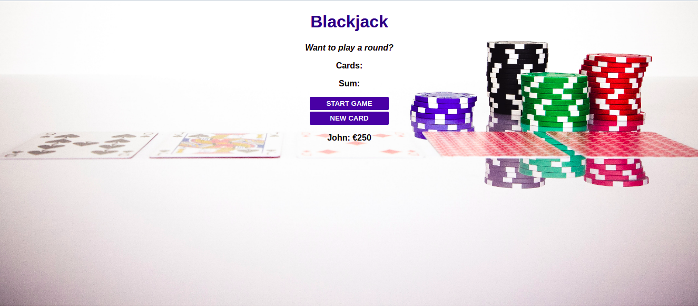
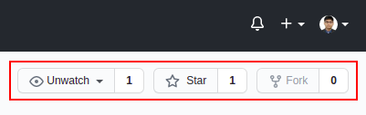
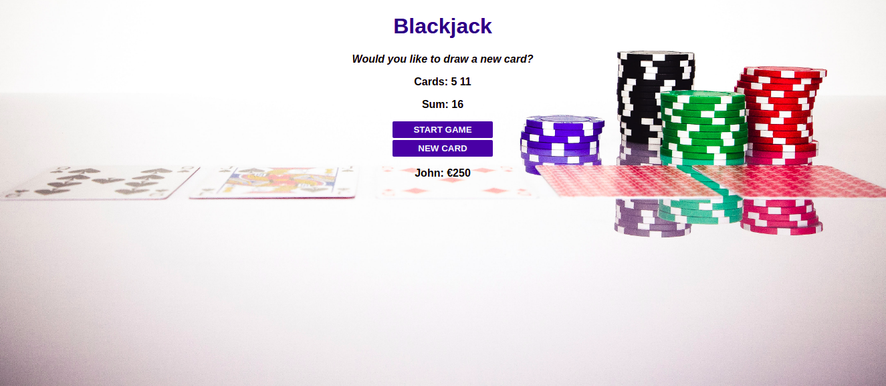

  <h3 align="center">Blackjack Web App</h3>

  <p align="center">
    The perfect app to give you an initial exposure to the fundamentals of the game, that none of us is a stranger to: Blackjack!
    <br />
  </p>
</p>


<!-- TABLE OF CONTENTS -->
<details open="open">
  <summary>Table of Contents</summary>
  <ol>
    <li>
      <a href="#about-the-project">About The Project</a>
      <ul>
        <li><a href="#built-with">Built With</a></li>
      </ul>
    </li>
    <li>
      <a href="#getting-started">Getting Started</a>
      <ul>
        <li><a href="#installation">Installation</a></li>
      </ul>
    </li>
    <li><a href="#usage">Usage</a></li>
    <li><a href="#license">License</a></li>
    <li><a href="#contact">Contact</a></li>
    <li><a href="#acknowledgements">Acknowledgements</a></li>
  </ol>
</details>


<!-- ABOUT THE PROJECT -->
## About The Project

<div style="text-align:center"></div>

Blackjack could be a good way to engage in social interaction while playing some cards.<br/>

For Blackjack enthusiasts or beginners alike, this Blackjack web app could be a great way to cherish the feeling of playing the game (for experienced players) or to get an initial exposure to the rules of it (for novices).

### Built With

These are the technologies that I used to build the Blackjack Web App:
* HTML5
* CSS3
* JavaScript


<!-- GETTING STARTED -->
## Getting Started

To get a local copy of the app, up and running on your system, follow these steps.


### Installation

1. Fork this repository
<div style="text-align:center"></div>

2. Clone the repository
   ```sh
   git clone https://github.com/theRangeCoder/Blackjack-web-app.git
   ```
3. Navigate into the directory
   ```sh
   cd Blackjack-web-app
   ```
4. Open the `index.html` file on your default browser or a browser of your choice
   ```sh
   xdg-open ./index.html
   ``` 


<!-- USAGE EXAMPLES -->
## Usage

Once you have successfully downloaded a local copy of the project and have opened it on your browser, you can start the game by hitting the `START GAME` button. Two cards will be drawn initially.<br/>

<div style="text-align:center"></div>

To continue the game, one needs to continue drawing cards until one attains Blackjack (a sum of 21) or is out of the game (a sum greater than 21). New cards can be drawn by hitting the `NEW CARD` button.<br/>
<div style="text-align:center"></div>

As soon as one gets a sum of 21 on the cards, one attains Blackjack and hence, wins the game!
<div style="text-align:center"></div>


<!-- LICENSE -->
## License

The README template, used for this project, was distributed under the MIT License. See `LICENSE` for more information.


<!-- CONTACT -->
## Contact

#### Shuvadarshan Bhual
* Drop me an [email](mailto:sbhual1998@gmail.com) 
* Follow me on [Twitter](https://twitter.com/theRangeCoder)
* Let us connect on [LinkedIn](https://www.linkedin.com/in/shuvadarshan-bhual)


<!-- ACKNOWLEDGEMENTS -->
## Acknowledgements
* [Othneil Drew](https://www.othneildrew.com) for the [README template](https://github.com/othneildrew/Best-README-Template)
* Background image by <a href="https://unsplash.com/@markusspiske?utm_source=unsplash&utm_medium=referral&utm_content=creditCopyText">Markus Spiske</a> on <a href="https://unsplash.com/s/photos/blackjack?utm_source=unsplash&utm_medium=referral&utm_content=creditCopyText">Unsplash</a>

